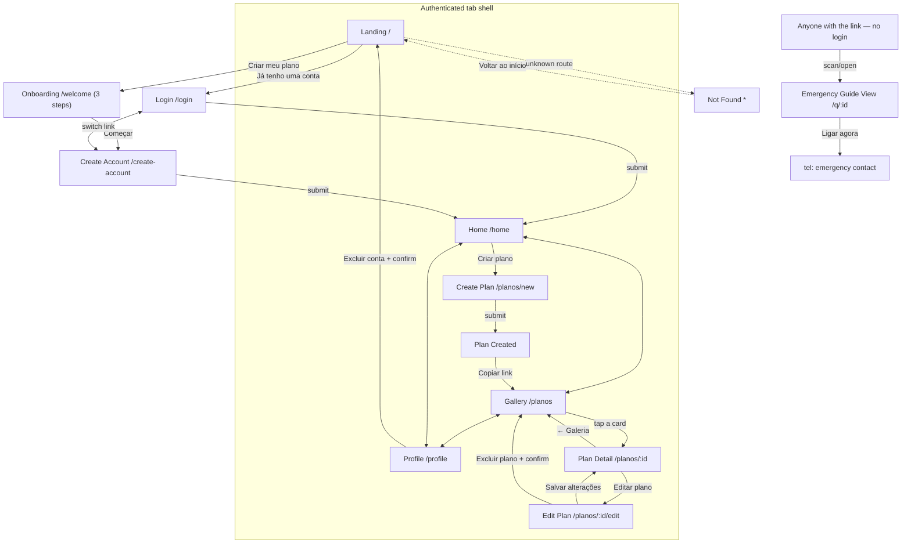

# GEMA — Design System & Screen Specification ("Broto")

> Source of truth for the GAB-31 React Native (Expo) rebuild. Supersedes any
> prior design notes in this repository. Derived from the Claude-generated
> design handoff bundle (`DesignGEMA.zip`, direction **1a "Broto"**, selected
> over two rejected explorations — "Cordão" and "Pétala") delivered on this
> issue, cross-checked against both `.dc.html` mock files' own inline
> stylesheets rather than taken on the handoff README's word alone.

## Audience & Tone

GEMA exists so that an autistic person, or someone with another non-visible
disability or condition, can be understood quickly by a stranger during a
crisis moment — being lost, overwhelmed, or non-verbal — without needing to
explain themselves in the moment. The repo's own root `README.md` states
this directly ("QrCode app that will allow personalized qr codes for
autistics or others syndromes in case they get lost or enter in a crisis").
That gives the product **two distinct audiences with different emotional
needs at different times**: the *plan owner*, filling out calm, unhurried
account/profile/editor screens ahead of time, and the *finder/helper*, a
stranger landing cold on the public Emergency Guide View who needs the
critical information (what helps, who to call) legible in seconds, with no
login friction.

The design handoff's own brand-direction note names the tone explicitly:
"Calm, airy, botanical... Generous whitespace, one green as the hero color,
warm cream background. No gradients, no emoji." That is corroborated
independently by the mock HTML itself — every screen in `GEMA App -
Broto.dc.html` uses soft cream backgrounds (`#fbf8f0`), generous padding,
a single restrained accent color, rounded/organic card shapes, and PT-BR
copy that is warm and first-person ("Sou autista e posso ficar
sobrecarregado...", "Obrigado por parar para ajudar") rather than clinical
or alarmist — no red/orange warning chrome, no siren iconography, nothing
that would read as an "emergency app" in the pager/911-dashboard sense.
**Confidence: high.** Both the written brand direction and the rendered
HTML mocks agree, independently, and both are consistent with the stated
purpose in the root README.

One nuance worth flagging (see Open Questions): the destructive-action red
(`#c23030`) and the emergency panel's "Ligar agora" call-to-action are the
only moments of urgency in an otherwise deliberately unhurried palette —
this is a **design choice**, not an oversight, reserving alarm-adjacent
color for the two moments that actually warrant it (deleting data, calling
for help), while keeping every other screen calm. This reading is inferred
from the consistent restraint elsewhere in the tokens, not stated outright
in the handoff — flagged with medium confidence.

This replaces the old (pre-Broto) web app's own implicit tone
assumptions, visible in `frontend/src/index.css` and
`frontend/src/components/Logo.tsx`: English-language copy/labels
throughout, an 8-petal single-tone (`#4F8F3D` only) sunflower with no gold
ring around the center dot, and Inter as the type family. The color
*tokens* in that old CSS are — notably — nearly identical hex-for-hex to
the new Broto tokens below (same greens, same cream, same asymmetric
`1.5rem 0.5rem 1.5rem 0.5rem` radius already existed as `--radius-organic`)
which suggests the underlying brand direction was already headed this way;
what Broto actually changes is the **typeface** (Inter → Figtree), the
**mark's detail** (8 single-tone petals → 12 alternating-tone petals with a
two-tone gold core), and — per the issue itself — the **copy language**
(English → PT-BR, "final-intent" per the handoff). This old system is not
used as a source of truth here per the issue's explicit instruction, only
cited as evidence of the tone this redesign is deliberately moving away
from/refining.

## Goals & Scope

This document is the **visual and interaction design specification** for
the GAB-31 React Native/Expo rebuild of the GEMA frontend: color, type,
radius, shadow and spacing tokens; the shared component inventory; the
13-screen catalogue (12 authenticated/public in-app screens + the public
Emergency Guide View); and the navigation/interaction model that ties them
together. It is written to be implementable directly against NativeWind
(Tailwind class tokens) and React Navigation, per the accompanying
implementation plan (`docs/plans/GAB-31-react-native-frontend-rebuild.md`).

**Explicitly out of scope** (named here so they are not silently assumed
away, matching the plan's own resolved decisions):

- **No backend integration.** All plan/section/auth data is local,
  in-memory mock state. Nothing here specifies API contracts, request/
  response shapes, or error states from a real server — the handoff
  README's data-model sketch (a `sections` table, a `POST /sections`
  endpoint) is preserved there for the *next* piece of work, not consumed
  by this design or its implementation.
- **No real QR code generation.** Every "QR" surface in every screen is the
  same dashed diagonal-stripe placeholder box shown in the mocks — this
  design does not specify a QR-encoding library or a real payload format.
- **No drag-gesture section reordering.** The mock's ⋮⋮ drag handle is
  rendered as a visual affordance, but the interaction it triggers here is
  tap-to-move (up/down), not a live pan gesture — a named, accepted
  shortcut (see Interactions & Flows below), not a design gap.
- **No inactive-plan state for the public link.** The handoff's own README
  flags this as "not yet designed" — this document does not invent one.
- **No native platform chrome** (status bar theming, splash screen art,
  app icon) beyond what's implied by the cream background and sunflower
  mark — those are packaging concerns for the Expo config, not this
  document.

## Design Tokens

Transcribed from the handoff README's "Design Tokens" section and verified
against the inline `<style>` blocks of both `GEMA App - Broto.dc.html` and
`GEMA Rebrand.dc.html` (direction `1a`) — the two mocks agree on every
value below.

### Color

| Token | Hex | Usage |
|---|---|---|
| Background (app) | `#fbf8f0` | App canvas, cream — the dominant surface |
| Canvas (docs-only) | `#eae6dc` | Only appears around the mock's own phone frames; never used in-app |
| Primary green | `#3e7a2f` | Primary buttons, active nav item, links, progress bars |
| Deep green | `#2f5233` | Headings (H1/H2), wordmark accent, mint-panel headline text |
| Mid green (petal A) | `#4f8f3d` | Alternating sunflower petal, list bullet dots |
| Mid green (petal B) | `#5a9c46` | Alternating sunflower petal |
| Mint surface | `#e9f3e3` | Tinted panel fill (emergency contact panel, icon tiles, avatar tile, success checkmark badge) |
| Mint border | `#d5e6c9` | Border on mint/QR-placeholder surfaces |
| Gold/amber (core ring) | `#c97b2e` | Sunflower core ring, numeral badges ("1 2 3"), the emergency-view top accent stripe |
| Gold/amber dark (core dot) | `#8f5219` | Sunflower center dot, "Seções" eyebrow in edit contexts, section-number micro-labels |
| Text primary | `#332e22` | Body text, input values, labels |
| Text muted | `#6b6354` | Supporting copy, metadata lines, nav inactive state |
| Placeholder text | `#a8a293` | Input placeholder copy |
| Border (warm) | `#e8e1d3` | Card/input/divider borders throughout |
| Destructive text | `#c23030` | "Excluir plano" / "Excluir conta" text-only links |
| Success dot | `#27803f` | Active-status dot (Gallery, Home activity, Plan Detail), success checkmark glyph |
| Inactive dot | `#b6b0a1` | Inactive-status dot (Gallery) |
| Surface white | `#ffffff` | Card/header/input backgrounds sitting on the cream canvas |

No gradients appear anywhere in the mocks except the QR-placeholder's
repeating diagonal stripe (a deliberate "this is a stand-in" pattern, not a
decorative gradient) — consistent with the brand direction's "no
gradients" rule.

### Typography

Figtree (Google Fonts), weights 400/500/600/700/800, loaded via
`@expo-google-fonts/figtree`. System sans-serif is the fallback while
fonts load.

| Role | Weight | Size | Line-height | Letter-spacing | Color |
|---|---|---|---|---|---|
| H1 (screen title) | 800 | 28–30px | 1.14–1.2 | -0.02em | `#2f5233` |
| H2 (card/section title) | 800 | 22px | 1.2 | normal | `#2f5233` |
| Eyebrow label | 700 | 12px | 1 | 0.14em, uppercase | `#3e7a2f` (or `#8f5219` in edit/warning contexts) |
| Body / muted copy | 400 | 15px | 1.5 | normal | `#6b6354` |
| Body (emphasized, on dark/mint) | 400 | 15–16px | 1.45–1.55 | normal | `#332e22` |
| Form label | 600 | 13.5px | 1 | normal | `#332e22` |
| Button label | 600–700 | 16px | 1 | normal | context-dependent |
| Section micro-label | 700 | 10.5–13px | 1 | 0.08–0.1em, uppercase | `#8f5219` |

The wordmark lockup itself (mark + "GEMA") renders at 800 weight, ~18–19px,
0.02em tracking, in `#332e22` on light headers and `#fbf8f0` when reversed
on a dark surface (only the "Cordão" rejected direction reverses it; the
selected "Broto" direction never puts the wordmark on a dark background).

### Radius

The signature shape of this design system is an **asymmetric corner**:
two opposite corners sharp, two rounded, giving cards a slightly organic,
hand-placed feel rather than a uniform rounded-rectangle grid.

| Token | Value | Usage |
|---|---|---|
| Card (large) | `24px 8px 24px 8px` | Primary cards (auth cards, success card, not-found card) |
| Card (medium) | `20px 6px 20px 6px` | Home action tiles, gallery cards |
| Card (small) | `16px 5px 16px 5px` | Recent-activity rows, section read/edit blocks, plan-detail sections |
| Tile | `22px 8px 22px 8px` | Profile avatar tile |
| Button (primary/secondary) | `14px` | All pill-ish but not fully round buttons |
| Button (compact, e.g. emergency call) | `13px` | Emergency panel's "Ligar agora" |
| Input | `12px` | Text inputs |
| Section mini-input/textarea | `9px` | Nested inputs inside a section editor block |
| Dot/toggle | full pill (`9999px`) | Status dots, Ativo/Inativo switch |
| QR placeholder | `14–16px` | Slightly rounded, not asymmetric — deliberately reads as a neutral placeholder, not branded chrome |

Every asymmetric radius in the mocks follows the same rule: **top-left and
bottom-right are the larger rounded corners, top-right and bottom-left are
sharp** — worth preserving exactly, not just "some corners rounded, some
not," since the consistency of *which* corners is what reads as
intentional rather than random.

### Shadow

| Token | Value | Usage |
|---|---|---|
| Card shadow | `0 2px 12px rgba(47,82,51,.05)` | All cards — extremely soft, tinted green rather than neutral black, barely-there lift |
| Phone-frame shadow (dev-only) | `0 24px 60px -24px rgba(51,46,34,.4)` | Only in the mock's own presentation chrome; has no in-app equivalent (there's no "device frame" concept inside the app itself) |

### Spacing & sizing (inferred from the mock's inline styles, not stated as
named tokens in the handoff — flagged as a light synthesis, not a literal
transcription)

The mocks consistently use a screen-edge padding of **24–28px**, a
section-to-section vertical rhythm of **18–24px**, and tight internal card
padding of **13–18px**. Component gaps within a row (icon-to-label, button
groups) sit around **8–14px**. There is no explicit spacing scale named in
the handoff README; the above are observed, consistent values across
screens rather than a documented token set — implementers should treat
them as a *convention to follow*, not a literal `spacing.ts` constant list,
unless the code agent chooses to formalize one.

## Component Inventory

Grounded in what recurs across the HTML mocks and named in the
implementation plan's component breakdown. Each is a shared, reusable
building block — no screen hand-rolls its own button or card chrome.

- **SunflowerMark / SunflowerWordmark** — the 12-petal mark (alternating
  `#4f8f3d`/`#5a9c46` petals rotated 30° apart around a `#c97b2e` ring with
  an `#8f5219` center dot), reproduced from the mock's inline SVG
  `<g id="gm">` definition. `SunflowerWordmark` pairs it with the "GEMA"
  text lockup for headers; `SunflowerMark` alone is used at three sizes in
  the mocks (small ~22–26px in headers/nav, medium ~52–76px in onboarding/
  empty states, large 88px on the Landing hero).
- **Button** — two variants only: **primary** (solid `#3e7a2f` fill, white
  text) for the main call-to-action per screen, and **secondary/outline**
  (white fill, warm border, dark text) for the paired lower-emphasis
  action (e.g. "Voltar" beside "Avançar" in onboarding, "Editar perfil" on
  Profile). There is no third "destructive button" variant — destructive
  actions are always the separate text-link pattern below, never a red
  button.
- **Card** — the asymmetric `24px 8px 24px 8px` panel with the soft green
  shadow; the general-purpose container for auth forms, the success
  screen, the not-found state, and the onboarding "example section"
  preview. Smaller asymmetric radii (see Radius table) are used inline for
  list-row cards rather than a separate component variant.
- **Input** — single-line labeled text field (label above, value/
  placeholder below in a bordered white box), used for email/password/
  name/title fields across Login, Create Account, Create/Edit Plan.
- **TextArea** — multiline sibling of Input, used only inside a section
  editor block for section body content; visually distinguished by a
  cream (not white) fill and smaller type, reflecting its nested,
  secondary position inside a `SectionEditorItem`.
- **StatusDot** — a small filled circle in either green (`#27803f`,
  active) or muted gray (`#b6b0a1`, inactive); appears standalone in
  Gallery/Plan Detail and paired with a text label ("Ativo") in Edit Plan.
- **SectionEditorItem** — the repeatable, editable block inside Create/
  Edit Plan's "Seções" list: drag-handle glyph (⋮⋮, decorative — see
  Interactions), a "Seção N" or the section's own title as a micro-label,
  a × remove control, a title `Input`, and a content `TextArea`.
- **SectionReadItem** — the read-only counterpart used on Plan Detail and
  the public Emergency Guide View: just the section title as an uppercase
  amber micro-label plus its body copy, no editing chrome at all.
- **QrPlaceholder** — the dashed/diagonal-striped square standing in for a
  not-yet-generated QR code, used identically (at three different sizes)
  in Onboarding step 3, Plan Created/Success, and Plan Detail.
- **EmptyState** (reusing `Card`) — the centered icon + message + link
  pattern used by Not Found; deliberately not a separate heavyweight
  component since nothing else in this scope needs a loading or error
  variant without a backend to produce one.

## Screens

Thirteen views total: twelve compose the app proper (public + tab-shell
authenticated screens), plus the standalone public Emergency Guide View
reached only by scanning/opening a plan's link. Routes below follow the
implementation plan's React Navigation route naming.

1. **Landing** (`/`, public) — The marketing front door. A simple header
   (wordmark left, "Entrar" link right) gives way to a centered hero: the
   mark at its largest size, the current headline slogan, a short
   supporting sentence, a solid primary CTA to start creating a plan, and
   a quieter link into an existing account. A three-item numbered list
   below a divider explains the product in one line each — create, carry,
   get scanned — closing the loop before the visitor commits to anything.

2. **Onboarding** (`/welcome`, public, 3 internal steps) — A single screen
   with three sequential states, tracked by a segmented progress bar and
   a "Passo N de 3" label in the header. Step one explains what the
   sunflower mark itself means; step two explains what a plan/section is
   and shows a worked example inside a card; step three shows the
   QR placeholder and ends in a "Começar" call-to-action that hands off
   into account creation. Each step after the first has a paired Voltar/
   Avançar button row.

3. **Login** (`/login`, public) and **Create Account** (`/create-account`,
   public) — Structurally identical: a narrow, centered `Card` (not
   full-bleed) holding an eyebrow, a title, stacked `Input` fields
   (Email/Senha for Login; Nome/Email/Senha plus an "at least 8
   characters" hint for Create Account), and a full-width primary button.
   The link to switch between the two flows sits deliberately *outside*
   the card, in plain muted text below it, keeping the card itself
   focused on one action.

4. **Home** (`/home`, authenticated, tab: Início) — The authenticated
   landing point, opening with a personalized greeting ("Olá, {name}.")
   and two side-by-side action tiles — a solid-green "Criar plano" tile
   and an outline "Escanear" tile — followed by a short "Atividade
   recente" list reusing the same small-card row pattern as Gallery, each
   row showing an icon, the plan's title, and its creation date plus
   status.

5. **Gallery** (`/planos`, authenticated, tab: Galeria) — A vertical list
   of every plan the user owns, each row a small card with a QR-swatch
   thumbnail, the plan's title and creation date, and a trailing status
   dot; inactive plans render the entire row at reduced (72%) opacity
   rather than hiding the dot alone, so inactive state reads at a glance.
   A full-width "+ Criar plano" button anchors the bottom. Tapping a row
   goes to Plan Detail, never straight into editing — an explicit
   correction called out in the handoff over an earlier pass.

6. **Plan Detail** (`/planos/:id`, authenticated) — A read-only view of
   one plan: a back link to Gallery and an active/inactive indicator share
   the top row, followed by the plan's title, its creation date and
   public URL as a metadata line, a centered QR placeholder, and then
   every section rendered read-only via `SectionReadItem`. A single
   full-width "Editar plano" button is the only way forward from here,
   keeping viewing and editing cleanly separated.

7. **Create Plan** (`/planos/new`, authenticated) — A form opening with an
   eyebrow, title, and one line of framing copy about sections, then a
   single plan-title `Input`, then the section editor: a running count
   ("N seções"), one `SectionEditorItem` per section, and a dashed
   "+ Adicionar seção" affordance that appends a fresh empty block. A
   full-width "Criar plano" button submits.

8. **Edit Plan** (`/planos/:id/edit`, authenticated) — Create Plan's
   sibling, pre-populated: the same title field and section editor
   (typically seeded with "Sobre mim" / "O que ajuda" / "Em uma
   emergência" per the example plan) but with an Ativo/Inativo toggle
   added to the header row and the plan's public ID/URL shown as
   metadata under the title. "Salvar alterações" is the primary action;
   below it, a right-aligned, red, text-only "Excluir plano" link is the
   only destructive control on the whole screen, deliberately understated
   next to the button chrome above it.

9. **Plan Created / Success** (reached after submitting Create Plan,
   authenticated) — A single centered `Card`: a small green check-circle
   icon, an "Plano criado" heading, the QR placeholder, the shareable
   `/q/:id` link shown inside a mint-tinted pill (not plain text — it
   visually reads as "this is the thing to copy"), and a full-width
   "Copiar link" button as the only action, since the plan itself is
   already saved by the time this screen appears.

10. **Profile** (`/profile`, authenticated, tab: Perfil) — Identity first:
    an avatar initial in the asymmetric tile shape, name and email beside
    it. Below a divider, a single stat block ("Planos criados") displayed
    as one large numeral rather than a chart or list — the design keeps
    this screen intentionally light on data. Two actions close the
    screen: an outline "Editar perfil" button, and, separated further by
    weight and color rather than a second divider, a centered red
    "Excluir conta" text link.

11. **Not Found** (`*`, public) — The simplest screen in the set: one
    centered `Card` holding the sunflower mark, a short "Página não
    encontrada" heading, one line of muted copy, and a "Voltar ao início"
    link — reusing the exact same empty-state shape the design would use
    for any other "nothing here" moment, rather than a bespoke 404
    illustration.

12. **Emergency Guide View** (`/q/:id`, public, no authentication) — The
    screen a stranger actually lands on after scanning a QR code, and the
    one screen only present in `GEMA Rebrand.dc.html`'s direction `1a`
    block rather than the main app mock. It opens with a thin amber
    accent stripe across the very top of the screen, a "Guia de apoio"
    eyebrow beside a small mark, and a first-person greeting headline
    written from the plan owner's own voice ("Olá, meu nome é Lucas."),
    followed by an empathetic framing paragraph. The plan's sections
    render below in order via `SectionReadItem` (the mock's own example
    shows "O que ajuda" as a bulleted list rather than a plain paragraph,
    the one section type in the whole system that renders as bullets
    instead of prose — worth preserving as a legitimate content-driven
    variation, not an inconsistency to normalize away). The screen ends
    in a mint-tinted, visually anchored emergency-contact panel — eyebrow,
    contact name, a large tappable phone number, and a full-width
    "Ligar agora" button wired to a `tel:` link — always visible at the
    bottom of the content rather than requiring a scroll to find, since
    this is the one piece of information a finder is most likely to need
    immediately.

## Interactions & Flows

**Two navigation shells, one auth gate.** The app root switches on a mock
signed-in flag between a **public stack** (Landing → Onboarding →
Login/Create Account, plus the always-public Emergency Guide View and Not
Found, none of which require the tab bar) and an **authenticated tab
shell** (Início / Galeria / Perfil, each tab hosting its own internal
stack so that, for example, Galeria can push Plan Detail and then Edit
Plan without losing the tab bar underneath, and Início can push Create
Plan and then the Success screen the same way). This mirrors the pattern
the handoff README states directly under "State Management": auth state
gates every `/planos/*`, `/home`, `/profile`, and `/welcome` route, while
`/`, `/login`, `/create-account`, and `/q/:id` stay reachable without
signing in.

**The section-editor flow** is the one genuinely multi-step interaction in
the system, shared identically by Create Plan and Edit Plan: each
`SectionEditorItem` carries a drag-handle glyph, a title input, and a
content text area; "+ Adicionar seção" appends a new empty block to the
end of the list; the × control removes a block, gated behind a
confirmation step (the handoff README recommends this even though the
static mock can't show it); and reordering is intentionally implemented as
tap-to-move rather than a live drag gesture — the handle renders for
visual fidelity to the mock, but nothing beneath it tracks a pointer
gesture. This is a scoped-down but explicitly named substitute, not a
silent omission.

**Destructive actions share one pattern app-wide**: they are always a
plain red text link, never a button, and always confirm before executing.
"Excluir plano" (Edit Plan), "Excluir conta" (Profile), and section
removal (Create/Edit Plan) all follow this same low-emphasis-control/
high-friction-confirmation shape — deliberately making the *control*
unobtrusive while making the *action* hard to trigger by accident.

## Open Questions / Assumptions

Flagged explicitly rather than silently resolved, per the design agent's
own mandate:

1. **Spacing scale is inferred, not documented.** The handoff README names
   token values for color, type, radius, and shadow explicitly but never
   names a spacing scale — the numbers in the Spacing & Sizing section
   above are read directly off the mock's inline styles, not transcribed
   from a stated token list. *Confidence: medium.* If the code persona
   wants a first-class `spacing.ts` token file (beyond ad hoc Tailwind
   spacing classes), those exact pixel values should be treated as a
   starting point to formalize, not gospel.
2. **The Landing headline is explicitly flagged as provisional by the
   handoff itself** ("current slogan — user has flagged this for future
   revision") — this document keeps it verbatim rather than rewriting it,
   since revising marketing copy is outside a design-token/system
   specification's mandate, but it should not be read as a locked, final
   string.
3. **The "alarm reserved for delete/call" reading of the destructive-red
   and call-to-action tokens** (see Audience & Tone) is my own synthesis
   across the token table and the mocks, not a statement made outright in
   the handoff README. *Confidence: medium* — worth a human sanity check
   if the palette is ever extended (e.g. adding a warning/toast color)
   rather than assuming it's license to expand red's usage.
4. **Inactive-plan public-link state and section-order persistence** are
   both explicitly deferred by the handoff README itself ("not yet
   designed, flag if needed" / "not in the stated schema, flag with the
   team") — repeated here only so this document doesn't read as silently
   ignoring them; no new design work is proposed for either in this pass.
5. **No dark mode is specified anywhere in the handoff.** Every mock is a
   single light, cream-background theme; this document does not invent a
   dark variant of these tokens. If a dark theme is ever wanted, it would
   need its own design pass rather than a mechanical color inversion,
   given how load-bearing the warm cream/white contrast is to the "calm"
   tone.
