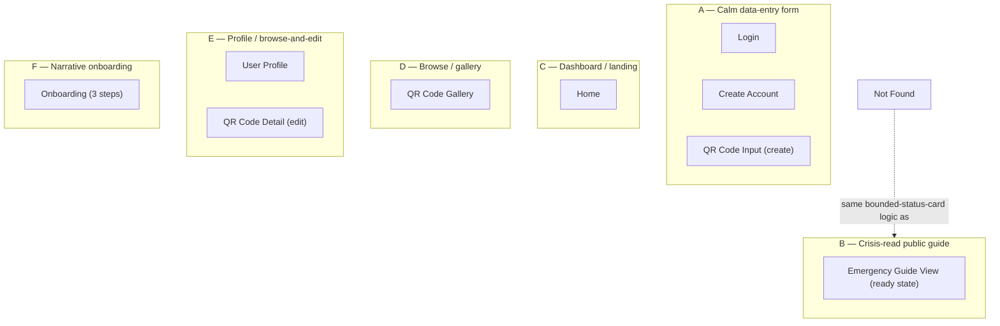
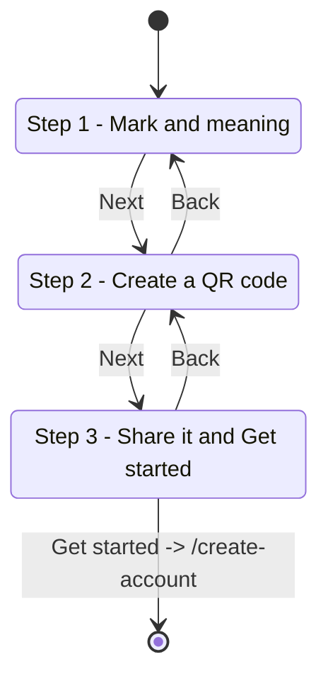
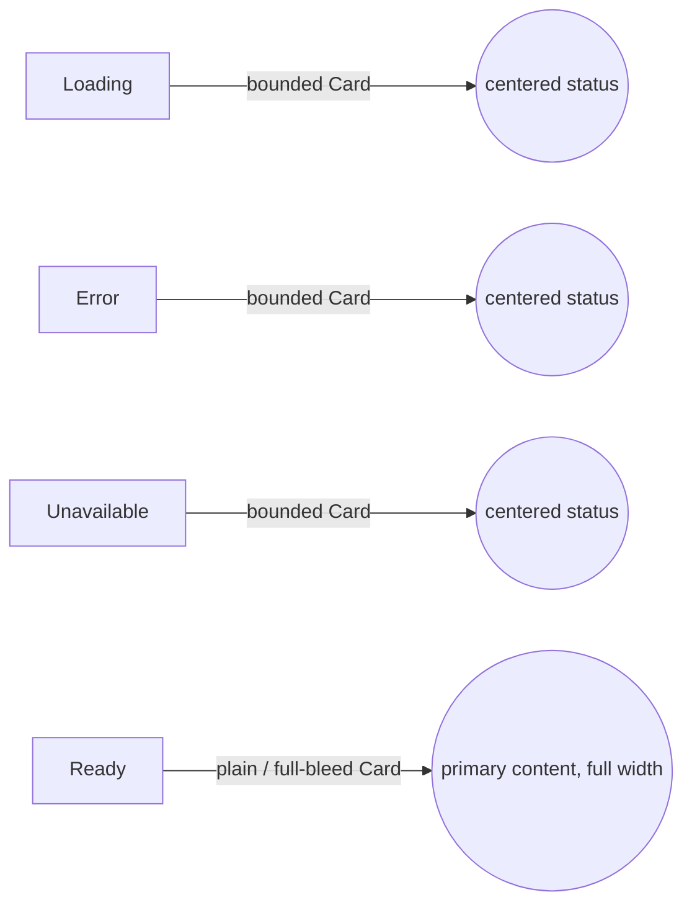

# GEMA Layout & Composition Redesign — Proposal (GAB-29)

This document proposes the layout/composition redesign for the screens
listed in the GAB-29 implementation plan. It does **not** touch color
tokens (`frontend/src/index.css`), the sunflower mark, or the type scale —
all of those are locked by `DESIGN.md` (GAB-7) and stay exactly as they
are. This is a redesign of how existing pieces are arranged, not what they
look like at the token level.

---

## 1. Audience & Tone

Evidence gathered before any layout decision:

- **`README.md`** states the literal purpose: a QR-code system carrying
  emergency/support information for autistic people or people with other
  syndromes "in case they get lost or enter in a crisis," read by *someone
  else* (a stranger, first responder, or support person) at the moment of
  crisis. This means there are **two distinct audiences with opposite
  needs**: (a) the profile owner / caregiver, doing calm, deliberate setup
  work, who can tolerate normal app chrome; and (b) a stranger under
  time pressure and possibly distress, reading `EmergencyGuideView`, who
  must understand the page in seconds with zero learning curve.
- **`DESIGN.md`** confirms this split structurally: `PublicLayout` (no nav,
  just the mark) is reserved for `/q/:publicId` (the scanned guide) and
  `/welcome` and `*`, explicitly because those pages "must be reachable by
  someone who isn't logged in and shouldn't be invited to navigate the
  internal app." `AppLayout` (full header + nav) is for the owner-facing
  CRUD screens. The redesign must preserve and sharpen this split, not
  blur it.
- **Existing copy tone** (read verbatim from every page) is calm, plain,
  reassuring, never clinical or cute: *"There's nothing wrong on your end…
  the best thing you can do is ask them directly and stay calm,"* *"We hit
  a snag… It's not you — please try again,"* *"No account required."* No
  jargon, no exclamation marks, no forced enthusiasm. This is evidence
  against any "fun/colorful" or "playful" treatment — the product is
  explicitly choosing calm and steady over energetic, even on success
  states.
- **`DESIGN.md`'s color rationale** independently confirms the calm
  reading: green was chosen for its association with mental-health/
  invisible-condition awareness causes, contrast ratios were specifically
  re-tuned for readability rather than visual punch, and the cream/warm
  palette ("warm cream instead of cool gray") signals a deliberately soft,
  human, non-clinical register — not a vibrant consumer-app register.
- **Component evidence**: `Card` already uses an intentionally asymmetric
  "organic" corner radius (`rounded-tl-2xl rounded-br-2xl rounded-tr-lg
  rounded-bl-lg`) instead of uniform corners — a small but real signal that
  the brand wants "organic/human," not "geometric/systematic." Layout
  decisions below lean into this (e.g. soft asymmetric section breaks)
  rather than rigid symmetric grids, but only as an accent, matching how
  the token is documented ("reserved for accents, not a whole new shape
  system").
- **No persona docs, no analytics, no target-age data exist in the repo.**
  I'm not assuming this is a children's app, a clinical/medical app, or a
  consumer social app — the only audience evidence is the README's
  framing (autistic/special-needs individuals and their support network)
  and the existing calm, plain copy. Where this leaves a real open
  question (e.g. whether `EmergencyGuideView` ever needs to support
  someone non-verbal or with low literacy on the *reading* side, which
  would push toward icon-led content), I flag it explicitly in §7 rather
  than picking a default.

**Tone summary used to drive every layout call below:** calm, plain,
unhurried, low-stimulus, human-but-not-cute. Crisis screens prioritize
legibility and zero ambiguity over density or decoration. Owner-facing
screens can be a little more spacious/considered (this is a setup task
done with care, not a high-frequency utility), but still avoid visual
noise — no shadows-on-shadows, no competing CTAs, no marketing-style hero
imagery.

---

## 2. Goals & Scope

**In scope** (per approved plan):
- Layout/composition redesign only, for: `Home`, `Login`, `CreateAccount`,
  `UserProfile`, `QrCodeInput`, `QrCodeGallery`, `QrCodeDetail`,
  `EmergencyGuideView` (highest priority), `NotFound`, `StyleGuide`,
  `Onboarding` (converted to a real multi-step flow — the one approved new
  "screen"/route addition).
- Defining a small set of named **layout archetypes** screens map onto,
  replacing the current single de-facto archetype ("centered card +
  stacked inputs," used almost verbatim by `Login`, `CreateAccount`,
  `QrCodeInput`, `QrCodeDetail`, `UserProfile`, and even `EmergencyGuideView`
  today).
- New component variants **only** where layout work genuinely requires
  them (identified per-archetype below).

**Out of scope:**
- Color tokens, type scale, the sunflower mark, business logic, new
  dependencies/icon libraries, any new screen beyond the Onboarding
  flow conversion.

---

## 3. Layout Archetypes

Today every screen (bar `NotFound`) is `<main max-w-X><badge/><Card><h1/>
<stacked inputs/></Card></main>` regardless of whether it's a form, a
dashboard, a gallery, or a crisis-read document. That sameness is the
problem named in the plan. Below are five archetypes, each with a real
structural identity, that the eleven screens map onto.

### A. **Calm data-entry form**
One focused task, one primary action, nothing competing for attention.
- Structure: narrow column (`max-w-sm`, narrower than today's `max-w-md`
  default, since these forms have 2-4 fields, not more), vertically
  centered in the viewport on tall screens rather than pinned to the top
  with `py-8` — the current pattern reads like a tall scroll of a form
  dropped at the top of an otherwise-empty page. Single `Card` containing:
  a short eyebrow/label line (not the dev-only wireframe badge — a real
  contextual label, e.g. "Account"), the H1, one sentence of supporting
  copy where useful, the field stack, the primary action, then a single
  low-emphasis secondary link/action below the card (not inside it) —
  pulling the "switch to the other auth screen" link visually outside the
  task boundary so the Card represents *only* the active task.
- Screens: `Login`, `CreateAccount`.
- Component needs: none new. Uses `Card` + `Input` + `Button` as-is.

### B. **Crisis-read public guide**
Highest priority. Optimized for a stranger, possibly under stress,
reading on a phone, who has never seen this app before and never will
again after this moment.
- Structure: full-bleed, not card-boxed. Today's guide is a `max-w-md`
  centered `Card` — i.e. a settings-panel treatment for the single most
  important screen in the product. Replace with: content sits directly on
  the page background (cream), no bordered box competing with the
  content for "this is the important thing" status. Top-to-bottom, single
  column, generous line-length-capped text width (`max-w-prose`, ~65ch)
  for readability, large heading, then the guide body as the dominant
  element on the page — nothing below the fold competes with it. The
  "Support guide" eyebrow label stays (it orients a confused reader: *this
  is what I'm looking at*) but as plain text above the heading, not inside
  a mint pill that reads as a UI-chrome badge.
- The "not active"/unavailable state and the error state intentionally
  keep a **bounded `Card`** (not full-bleed) — these are short
  reassurance messages, not the primary content, so containing them in a
  smaller centered box correctly signals "this is a short status note,"
  contrasting with the full-bleed treatment for an actual found guide.
  This also matches existing copy intent ("ask them directly and stay
  calm") — a small contained message, not a take-over-the-screen one.
- Component needs: new `Card` variant — **`bordered={false}` / `variant="plain"`**
  prop on `Card` that drops the border/shadow/padding-box treatment and
  renders as a plain content container (still reuses Card for consistent
  max-width/spacing conventions, just strips the "boxed panel" visual).
  This is the one Card variant justified by real layout need named in the
  plan ("a borderless/full-bleed Card variant").
- Screens: `EmergencyGuideView` (found+active state only; unavailable/error
  states keep the existing boxed `Card`).

### C. **Dashboard / landing**
The authenticated home base — orientation + entry points, not a form.
- Structure: two-zone layout instead of today's single linear stack
  (heading → buttons → one card). Top zone: greeting + the two primary
  actions (scan / gallery) as a horizontal action row, sized for thumb
  reach, visually the heaviest thing above the fold. Bottom zone: "Recent
  activity" promoted from a single full-width afterthought `Card` into a
  **2-column responsive grid of compact activity cards** (falls back to 1
  column with no activity / empty state copy when there's nothing yet) —
  giving Home actual dashboard structure rather than "hero + one card."
- Screens: `Home`.
- Component needs: none new — reuses existing `Card`/`Button` in a grid
  Tailwind already supports (`grid grid-cols-1 sm:grid-cols-2`, same
  pattern already used in `QrCodeGallery`).

### D. **Browse / gallery**
Scanning many items quickly, picking one.
- Structure: keep the grid (it's the one place the codebase already does
  something other than "centered card"), but fix what's currently
  arbitrary: the `h-32 bg-mint-50` block is an unlabeled filler div with
  no semantic role. Replace with a real **thumbnail/status row**: a small
  fixed-size leading swatch area (still mint-50, now explicitly a
  "code preview" placeholder slot) sitting *beside* the title/date text in
  a horizontal card layout, not stacked above it — this reads faster when
  scanning a grid of many cards, and matches the actual content shape
  (title + one date, not a tall content card). Grid moves from 2-column
  max to 3-column on wide viewports (`sm:grid-cols-2 lg:grid-cols-3`)
  since cards get shorter.
- Screens: `QrCodeGallery`.
- Component needs: none new.

### E. **Profile / browse-and-edit**
A single record's detail, viewed and acted on, sitting between "form" and
"dashboard" — not a 4-field auth form, but not a multi-item browse either.
- Structure: header zone (identity: name, email — visually distinct from
  the action zone, e.g. via the asymmetric `Card` corner or a plain
  borderless top section) separated from a **stats/fact row** (QR codes
  created, rendered as a labeled stat, not an inline sentence) which is
  separated from the **actions row** at the bottom, with destructive
  action (`Delete account`) visually deprioritized — smaller, or pushed to
  a clearly separated zone — relative to `Edit profile`, instead of the
  two buttons sitting side by side at equal visual weight as today.
- `QrCodeDetail` reuses the same archetype shape (identity/context zone +
  field-edit zone + actions zone with the same danger-deprioritization)
  rather than the plain stacked-form treatment it has today, since it is
  conceptually "view & edit one record," same as Profile, not a first-time
  data-entry form like Login/CreateAccount.
- Screens: `UserProfile`, `QrCodeDetail`.
- Component needs: none new.

### F. **Narrative onboarding (multi-step)**
The one new "screen" in scope: converting `Onboarding.tsx` from a single
scrolling page into a real step-by-step flow.
- Structure: a `Header`-level **progress-indicator mode** (e.g. "Step 1 of
  3" + a simple step dots/bar) replaces the public mark-only header for
  this flow specifically, since the user is now moving through discrete
  steps rather than reading one static page. Steps:
  1. **Mark + meaning** — the sunflower symbolism blurb, current content,
     alone on its own step (currently it's squeezed above two more cards;
     giving it a full step lets the brand story breathe instead of
     reading as a preamble to the real content).
  2. **How it works, step 1** — "Create a QR code" card content, full
     focus, large.
  3. **How it works, step 2 + CTA** — "Share it" card content plus the
     "Get started" primary button, since the last step is naturally where
     the conversion action belongs.
  Forward/back navigation: a `Button secondary` "Back" + `Button primary`
  "Next"/"Get started" pair at the bottom of each step, consistent
  position across steps so a user always knows where to look next. No
  skip-ahead / step-jumping via the indicator (keep it informational only)
  since this is a short 3-step flow, not a long wizard.
- Component needs: new **`Header` progress-indicator mode** — e.g. a
  `progress={{ step: 1, total: 3 }}` prop that, when present, renders a
  step indicator instead of the public mark-only header content, reusing
  `PublicLayout`'s shell. This is the one Header variant justified by the
  plan ("a Header progress-indicator mode for onboarding").
- Screens: `Onboarding` (now a 3-step flow within the single `/welcome`
  route — no new route is introduced; step is client-side state, per the
  plan's instruction not to add screens beyond this one).

### Mapping table

| Screen | Archetype | New component variant needed |
| --- | --- | --- |
| `Home` | C — Dashboard/landing | none |
| `Login` | A — Calm data-entry form | none |
| `CreateAccount` | A — Calm data-entry form | none |
| `UserProfile` | E — Profile/browse-and-edit | none |
| `QrCodeInput` | A — Calm data-entry form (single-task creation, same shape as auth forms) | none |
| `QrCodeGallery` | D — Browse/gallery | none |
| `QrCodeDetail` | E — Profile/browse-and-edit | none |
| `EmergencyGuideView` | B — Crisis-read public guide | `Card` borderless/plain variant (found+active state only) |
| `NotFound` | B-lite — same bounded-card-on-plain-background logic as the guide's "unavailable" state, since it's also a brief, calm status message to someone who didn't choose to be here | none (already simple; only spacing/centering adjustments) |
| `StyleGuide` | Reference page — left as a plain, dense documentation layout; not a user-facing archetype, but loosely follows D's grid logic for the color/variant swatches it already has | none |
| `Onboarding` | F — Narrative onboarding (multi-step) | `Header` progress-indicator mode |

`QrCodeInput`'s post-submit "QR code created" success state is treated as
a brief confirmation, same logic as `NotFound`/the guide's unavailable
state: a small bounded `Card`, not full-bleed — it's a short, single fact
("here's your link"), not primary content to read at length.

---

## 4. Components — summary of changes

| Component | Change | Why |
| --- | --- | --- |
| `Card` | Add `variant?: 'boxed' \| 'plain'` (default `'boxed'`, current behavior unchanged). `'plain'` drops border/shadow/padding/bg, keeping only the children passthrough — used so existing max-width/spacing conventions around Card usage don't need to be reinvented for full-bleed content. | Needed by archetype B (`EmergencyGuideView` found+active state). |
| `Header` | Add optional `progress?: { step: number; total: number }`. When present, render a step indicator (e.g. "Step {step} of {total}" + simple dot/bar row) in place of nav links; otherwise render exactly as today. | Needed by archetype F (`Onboarding` multi-step). |
| `Button`, `Input`, `Logo` | No changes. | Existing API already covers every archetype's needs. |

No new components, no new dependencies, no icon library — all of the
above is achievable with existing Tailwind utilities and the current
token vocabulary, per the plan's constraint.

---

## 5. Interactions & Flows

- **Onboarding flow**: `/welcome` loads on step 1. "Next" advances step
  state (no route change); "Back" on step 1 has no back target (button
  hidden or disabled-and-hidden, not shown disabled, to avoid a dead-end
  affordance). Step 3's primary button is the existing `Link to
  "/create-account"` wrapped `Button`, unchanged in destination — only its
  position (now end-of-flow rather than end-of-scroll) changes.
- **EmergencyGuideView**: state machine (`loading` / `error` / `unavailable`
  / `ready`) is unchanged — only the `ready` state's visual container
  changes (boxed → plain/full-bleed). `loading`/`error`/`unavailable`
  keep the bounded-card treatment they already use, consistent with the
  "short status note stays boxed" rule in §3.B.
- **Gallery → Detail**: unchanged click-through (`Link` wrapping the whole
  card to `/qr/:publicId/edit`); only the card's internal layout (thumbnail
  beside text vs. above text) changes.
- **Profile / Detail destructive actions**: `Delete account` / `Delete`
  remain functionally identical (no confirmation-dialog scope creep); only
  their visual placement/weight relative to the primary action changes, to
  reduce the chance of an accidental click on a destructive action sitting
  at equal visual weight next to a safe one.

---

## 6. Diagrams

### 6.1 Archetype map (which screens share which structure)

### 6.2 Onboarding step flow

### 6.3 EmergencyGuideView state-to-container mapping

---

## 7. Open questions / assumptions

- **No design mockups or Figma access exist for this work** (the Figma
  file referenced in `DESIGN.md` is explicitly noted as rate-limited and
  not the working source of truth); this proposal originates the layout
  from scratch the same way GAB-7 originated the color system in code, per
  the plan's instruction. The code agent's implementation, once approved,
  is the new source of truth for layout the same way `index.css` is for
  color.
- **Reading ability / literacy level of the person scanning a code is
  unknown.** The README and existing copy assume free-text reading
  (`description` is plain prose). I have not proposed any icon-led or
  pictogram-based redesign of `EmergencyGuideView` content itself — only
  its container — because (a) that would be a content/business-logic
  change out of scope for this layout-only ticket, and (b) no evidence in
  the repo indicates the guide content model supports anything but text
  today (`title`/`description` strings). Flagging this as a future
  consideration, not something this redesign attempts to solve.
  This proposal assumes a mobile-first viewport for `EmergencyGuideView`
  specifically (since "stranger scans a phone camera" is the README's
  literal scenario), but that assumption should be verified by the
  implementer against an emulator/real device, not just a resized desktop
  browser.
- **`StyleGuide.tsx` is left least-touched.** It's a developer reference
  page, not a real user-facing screen, so it doesn't get a named archetype
  of its own — only minor spacing consistency with archetype D's grid
  logic, since it already happens to use a swatch grid. If the team wants
  it to also demo the two new component variants (`Card` plain mode,
  `Header` progress mode), that's a small addition the code agent can make
  while implementing, not a layout decision this document needs to force.
- **Onboarding step persistence**: this proposal assumes step state resets
  on every visit/reload (no `localStorage`/URL query param persistence of
  current step), since the existing page has no such persistence and nothing
  in the plan asks for it. If a user should be able to deep-link to step 2,
  that would need explicit confirmation before implementation.
- **"Recent activity" empty state on Home** (archetype C) needs copy for
  the zero-items case; existing code never reaches an empty state (it's
  always the same placeholder sentence), so the code agent will need to
  decide exact empty-state copy in the same calm/plain register as the
  rest of the app — not specified further here since it's a copy decision,
  not a layout one.
