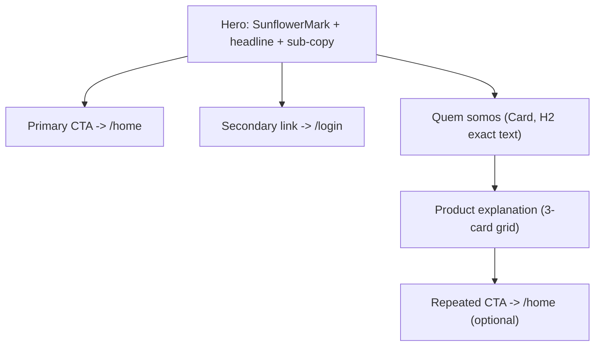
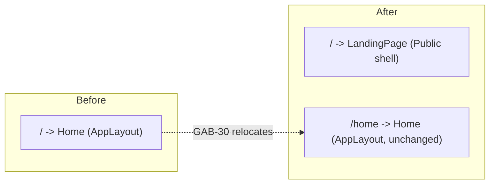
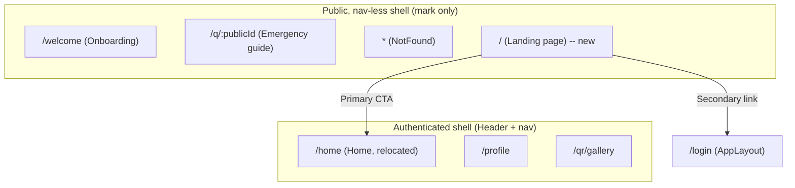

# GEMA Public Landing Page — Design Document (GAB-30)

This document designs the new public root route `/` — a marketing/explainer
landing page shown to logged-out visitors, replacing `Home.tsx` at that
route. `Home.tsx` itself is unchanged in content/behavior and simply moves
to `/home`. No backend changes. No new npm dependencies. No new visual
assets beyond the existing `SunflowerMark`.

---

## 1. Audience & Tone (evidence-based)

Two audiences already coexist in this codebase, established in `DESIGN.md`
and `DESIGN_PROPOSAL.md` (GAB-29) and visible directly in `App.tsx`'s
`AppLayout`/`PublicLayout` split:

- **Owner-facing, logged-in screens** (`Home`, `Profile`, `Gallery`, etc.) —
  calm, plain, utilitarian, behind `AppLayout`.
- **Public, pre-login screens** (`/welcome` Onboarding, `/q/:publicId`
  emergency guide, `*` NotFound) — behind `PublicLayout` (mark-only header,
  no nav, no invitation to explore the logged-in app). The landing page is
  a **new addition to this second group**: it is the marketing entry point
  that sits in front of the app, the same relationship claude.ai's public
  site has to the claude.ai app (explicitly given as the model to follow).

Tone evidence, read verbatim from the existing pre-login pages this new
page sits alongside:

- `Onboarding.tsx`: *"Our mark combines the sunflower lanyard — a symbol
  worn to signal a hidden disability or need for support — with the green
  of the awareness-cord tradition. Green petals, a warm golden center: a
  quiet sign that help can be asked for and given."* and *"Print it, wear
  it, or attach it wherever it's needed. Anyone who scans it sees your
  guide instantly — no account required."*
- `NotFound.tsx`: *"We couldn't find what you were looking for."* — plain,
  short, no apology theatrics, no exclamation marks.
- `README.md`'s own framing of the product: a QR code carrying emergency/
  support information for autistic people or people with other syndromes,
  read by someone else at the moment the person "gets lost or enters a
  crisis," so first responders/support people can help.
- `DESIGN.md`'s documented rationale for the green/gold palette: green
  chosen for its mental-health/invisible-condition awareness association;
  contrast ratios re-tuned for *readability*, not visual punch; cream
  background chosen explicitly as "warm... instead of cool gray" — a soft,
  human, non-clinical register.
- `DESIGN_PROPOSAL.md` (GAB-29) names this register explicitly: *"calm,
  plain, unhurried, low-stimulus, human-but-not-cute... no jargon, no
  exclamation marks, no forced enthusiasm... no marketing-style hero
  imagery."* That last clause is the strongest piece of evidence directly
  bearing on a landing page brief that, in a generic SaaS template, would
  default to a big illustrated/photographic hero — this codebase has
  already explicitly rejected that move for itself.

**Tone summary driving this design:** calm, plain, reassuring, never
clinical, never "hype" marketing copy, no exclamation points, no stock
photography/illustration. The hero must communicate gravity and warmth at
once — this is a tool for moments of crisis, not a productivity SaaS — so
the copy register is closer to a support-org's public site than a startup
landing page (short declarative sentences, second person "você", concrete
language over abstract "empowering" adjectives).

**Language note:** all existing in-app copy (`Home.tsx`, `Onboarding.tsx`,
`NotFound.tsx`) is in English today, even though the acceptance criteria
for this ticket require the landing page to be in Portuguese. This is a
deliberate, ticket-scoped exception (Portuguese is the explicit acceptance
criterion for *this* page only) — not a contradiction to resolve by
translating the rest of the app, which is out of scope here. Flagged again
in §7.

---

## 2. Goals & Scope

**In scope:**
- One new page, `LandingPage.tsx`, mounted at the public root `/`.
- Three required sections: hero, "Quem somos", product explanation.
- All visible copy in Portuguese.
- Primary CTA → `/home` (not `/create-account`).
- Reuses only existing components/tokens; no new visual assets.

**Out of scope (explicitly, per resolved decisions):**
- Any nav/header link to this page from the logged-in app.
- New illustration/photography/demo media for the hero (sunflower mark
  only, for this iteration).
- Translating the rest of the app to Portuguese.
- Backend changes of any kind.

**Routing change implied (for the code agent, not this doc's job to
implement):** `/` → new `LandingPage` under a public, nav-less shell;
former `/`-mounted `Home` → `/home` under the existing `AppLayout`.

---

## 3. Architecture / Components

### 3.1 Page shell

The landing page is logically a **new fourth pre-login screen**, alongside
`/welcome`, `/q/:publicId`, and `*`. It should use a shell consistent with
`PublicLayout`'s existing mark-only treatment — but note one real
distinction: `PublicLayout` was designed for screens a stranger lands on
*involuntarily* (a scanned QR, a 404, a confused mid-flow state) where the
explicit goal is "don't invite further navigation." The landing page is
the opposite case — a voluntary front door whose entire job *is* to invite
one specific next step (the CTA to `/home`). Reusing `PublicLayout` as-is
(bare mark, no links at all) would under-serve that job by giving the page
no way to expose a secondary "Login" affordance for returning users.

Recommendation: extend `PublicLayout` minimally rather than introduce a
new shell or new `Header` variant — render the existing bare-mark strip
(`SunflowerMark` only, exactly as `PublicLayout` does today for
`/welcome` and `*`) and let the **page content itself** carry the login
affordance as a small text link in the hero section, not in the shell
chrome. This keeps `Header`'s API untouched (no new prop) and keeps the
top strip's "no nav invitation into the internal app" property intact for
every other `PublicLayout` consumer, while still giving a returning user
a way back in. This is the recommended approach; the alternative
(give `Header`/`PublicLayout` a new "marketing" mode with a Login link in
the chrome) is rejected because it would change shared-shell behavior for
`/welcome`, `/q/:publicId`, and `*` too, which is unrelated scope creep.

### 3.2 Section-by-section component mapping

| Section | Layout | Components reused | Notes |
| --- | --- | --- | --- |
| **Hero** | Centered column, `max-w-3xl`, generous top/bottom padding (`py-16`/`py-20`), matching the calm/spacious register `DESIGN_PROPOSAL.md` assigns to non-urgent pre-login content | `SunflowerMark` (large, `size={64}` or `72`, centered above headline — same "mark + headline" composition already used by `Onboarding` step 1 and `NotFound`), `Button variant="primary"` for the CTA, plain `<Link>` (text, `text-leaf-green underline`, same pattern as `NotFound`'s "Back to home" link) for the secondary "Já tenho conta — Entrar" login affordance | H1 uses the documented 32px/bold scale. No image/illustration asset — explicitly resolved by the product owner for this iteration. The mark itself *is* the hero visual, consistent with how `Onboarding` step 1 already uses the mark alone as a "this is who we are" beat. |
| **"Quem somos"** | `Card variant="boxed"` (default), single column, `max-w-2xl`, heading exactly `"Quem somos"` per resolved decision | `Card`, standard H2 (24px/bold) + body copy (16px regular, `text-text-warm-600`) | Boxed card matches archetype-E/A precedent of using a bounded `Card` for a contained block of explanatory prose, rather than full-bleed (full-bleed/`plain` variant is reserved by precedent for the crisis-read guide content itself, not marketing copy — using it here would blur a distinction the codebase just established). |
| **Product explanation** | 3-column responsive grid on wide viewports (`grid grid-cols-1 sm:grid-cols-3 gap-4`), collapsing to a single stacked column on mobile | Three `Card` instances (`boxed`, the default), each with a short H3 + 1-2 sentence body — same shape as the existing "Recent activity" card grid pattern in `Home.tsx` (`grid grid-cols-1 sm:grid-cols-2`), extended to 3 columns since this grid holds short explanatory steps rather than data records | Mirrors the "Create a QR code" / "Share it" two-card sequence already written in `Onboarding`, but condensed to fit a single non-interactive section (no step navigation needed here — this is a one-screen overview, not a guided flow) |
| **Footer CTA (optional repeat)** | Simple centered block under the third section, **same primary Button** repeated, `mt-12` | `Button variant="primary"` | Repeating the CTA at the bottom is a common pattern for a single long scroll page; recommended but not load-bearing — see open question if PO wants single-CTA-only. |

### 3.3 Component reuse — no new component variants needed

Unlike GAB-29 (which needed `Card`'s `plain` variant and `Header`'s
`progress` mode), this page needs **zero new component props**. Everything
maps onto:
- `SunflowerMark` (existing `size`/`className` props)
- `Card` with `variant="boxed"` (the default — no prop needed)
- `Button` with `variant="primary"` / implicit secondary text link
- Existing Tailwind tokens from `index.css` (`text-text-warm-900`,
  `text-text-warm-600`, `bg-surface-cream`, `text-leaf-green`, grid
  utilities already used in `Home.tsx`/`QrCodeGallery.tsx`)

This keeps the implementation plan's stated constraint ("no new npm
dependencies," reuse of `Card`/`Button`/`Logo`) literally true at the
component-API level too.

---

## 4. Interactions / Flows

- **Primary CTA** ("Ver minha área" / "Começar" — exact label TBD by code
  agent within the tone guidelines in §5): `<Link to="/home">` wrapping
  `Button variant="primary"`, per the resolved decision that this links to
  the relocated dashboard, not `/create-account`. This means a
  not-yet-authenticated visitor clicking it lands on `/home` — whatever
  auth gate (if any) exists today for `Home`'s contents is unchanged by
  this ticket; the landing page does not add or remove auth logic.
- **Secondary "Entrar" (Login) link**: plain text link to `/login`, styled
  like `NotFound`'s existing back-link (`text-leaf-green underline`),
  placed near the hero CTA but visually subordinate (smaller, no button
  chrome) — for a visitor who already has an account and doesn't need the
  explainer.
- **No other interactivity.** This is a static informational page: no
  forms, no client state, no loading/error states (unlike
  `EmergencyGuideView`'s state machine) — content is fully static JSX, same
  as `Onboarding`'s per-step content blocks minus the step navigation.
- **Routing**: `/` now renders `LandingPage` (new public shell, no
  `AppLayout` nav). `/home` renders the existing `Home` inside `AppLayout`,
  unchanged. No route in the app's authenticated nav (`Header`'s
  `NAV_LINKS`) points back to `/` — per the resolved decision, the
  logged-in app never link back to the marketing page, matching the
  claude.ai analogy given.

---

## 5. Portuguese copy direction (key messages, not final marketing copy)

Grounded in `README.md`'s actual product description: *"QrCode website that
will allow personalized qr codes for autistics or others syndromes in case
they get lost or enter in a crisis. The QR will contain necessary
information/guideline that will help others to support the person in case
of emergency."*

**Hero section** — state plainly what GEMA is and who it's for, in one
short headline + one supporting sentence. Avoid abstract SaaS language
("solução inovadora", "transforme sua vida") — the existing copy register
never does this. Example direction (not final copy):
- Headline: something naming the concrete object and purpose directly,
  e.g. *"Um QR code que pode ajudar em um momento de crise."*
- Supporting line: who it's for and the core mechanic, e.g. *"GEMA cria
  códigos QR pessoais com as informações que alguém precisa para apoiar
  você — ou a pessoa que você cuida — em uma emergência."*
- CTA label: action-oriented, no hype, e.g. *"Começar"* / *"Acessar"*
  (linking to `/home`), with a smaller *"Já tem uma conta? Entrar"* nearby.

**"Quem somos"** — per the resolved exact heading. Content should cover
GEMA's *idea/vision*, not feature mechanics (mechanics belong in the third
section). Grounded in the sunflower-symbolism text already written for
`Onboarding` (reusable as the *idea*, not verbatim copy-paste, since that
text is currently in English and addressed to a different moment in the
funnel) — translate the underlying concept, not the literal English
sentence:
- Mention the sunflower lanyard symbolism (hidden disability / need for
  support) and why green was chosen (calm, mental-health/invisible-
  condition association) — this is GEMA's actual stated brand idea per
  `DESIGN.md`, not invented for this page.
- Frame GEMA's vision in human terms: helping autistic people and people
  with other conditions feel safer, and helping the people around them
  know how to help — not a generic "our mission is innovation" paragraph.

**Product explanation (3-card section)** — directly mirrors the
`README.md` "How It Works" steps and `Onboarding`'s existing two-step copy,
translated and condensed to three short cards:
1. *Crie seu código* — short guide describing what the person needs in an
   emergency (mirrors `Onboarding`: "Create a QR code... add a short guide
   describing what someone should know or do").
2. *Leve com você* — print it, wear it, attach it wherever needed (mirrors
   `Onboarding`: "Print it, wear it, or attach it wherever it's needed").
3. *Alguém escaneia, e ajuda* — anyone who scans it sees the guide
   instantly, no account required, in the moment it's needed (mirrors
   `Onboarding`'s "Anyone who scans it sees your guide instantly — no
   account required" and README's "QR code is scanned in an emergency →
   relevant information is displayed instantly").

This keeps the landing page's claims strictly traceable to README's
described flow and Onboarding's already-approved explanation of the same
flow — no new claims about functionality that doesn't exist yet (no
mention of features not in scope, e.g. no claim about gallery management
or multi-profile support unless already real in the product).

---

## 6. Accessibility / contrast notes

Cross-checked against `DESIGN.md`'s documented AA-safe text tokens — every
new text element on this page must use a token already certified there:

- All headline/body text: `text-text-warm-900` (12.7:1 on cream) for
  headings and primary copy, `text-text-warm-600` (5.6:1 on cream) for
  secondary/supporting copy — both already used this way throughout the
  app, no new tone needed.
- Primary CTA button: use `Button variant="primary"` unmodified — its fill
  is already `primary-green-dark` with white text at 5.2:1, per `DESIGN.md`.
  **Do not** style the hero CTA with the lighter `primary-green` fill
  directly — that tone is fill-only for icons/large swatches and fails AA
  with white text (3.9:1), exactly the trap `DESIGN.md` already warns
  against.
  fine to use `mint-50` (`bg-mint-50`) for a tinted card or section
  backdrop if the section needs visual separation from the cream body
  background, since that token is already approved for soft fills.
- The "Quem somos" and product-explanation `Card`s use the existing
  `boxed` variant exactly as styled (`border-border-warm-200`,
  `bg-base-white`) — no new contrast surface introduced.
- Secondary "Entrar" link: `text-leaf-green underline` — already the
  documented text-safe link green (8.3:1 on cream), reusing `NotFound`'s
  exact link styling rather than inventing a new link color.
- `SunflowerMark`'s `role="img"` + `aria-label="GEMA sunflower mark"` is
  already accessible as shipped; no change needed, just reuse as-is at a
  larger `size`.
- Heading hierarchy: page should have exactly one `<h1>` (hero headline),
  with "Quem somos" and the product section heading as `<h2>`, and the
  three product cards' short titles as `<h3>` — matching the documented
  H1/H2/H3 type scale and avoiding skipped heading levels for screen-reader
  navigation.

---

## 7. Diagrams

### 7.1 Page section flow

### 7.2 Routing change

### 7.3 Shell relationship to existing pre-login screens

---

## 8. Open questions / assumptions

- **Login link placement and shell extension.** I'm recommending the login
  affordance live in page content (hero section), not in `PublicLayout`'s
  shared chrome, to avoid changing shared behavior for `/welcome`,
  `/q/:publicId`, and `*`. This is my judgment call, not a PO-confirmed
  decision — flagging explicitly since it's the one place this design
  extends an existing shared component's *usage* (not its API).
- **Exact CTA/headline wording** is left to the code agent within the tone
  and message constraints in §5 — this document specifies key messages and
  register, not final marketing copy, per the task's own instruction.
- **Repeated footer CTA** (§3.2, §7.1) is a recommendation, not a resolved
  requirement. If the PO wants exactly one CTA on the page, drop the
  footer repeat — no structural impact on the other sections.
- **Mixed-language app state**: this page is Portuguese while the rest of
  the app (`Home`, `Onboarding`, `Login`, etc.) remains English. This is
  intentional per the acceptance criteria (Portuguese is named only for
  this landing page) but creates a jarring language switch for a visitor
  who clicks through to `/home`/`/login`. Flagging as a known, accepted gap
  — full i18n is out of scope for GAB-30.
- **No new imagery confirmed for this iteration** (resolved decision); this
  document assumes a future iteration may introduce a product screenshot
  or illustration in the hero or product-explanation section once assets
  exist. The 3-card grid layout in §3.2 was deliberately chosen so an
  icon or small illustration could later slot above each card's H3 without
  a structural rewrite — noted as a forward-compatible choice, not a
  commitment to build it now.
- **No Figma access** (per `DESIGN.md`, the source Figma file is
  rate-limited and the codebase itself is the working source of truth);
  this design originates directly from code/token evidence the same way
  `DESIGN.md` and `DESIGN_PROPOSAL.md` did, with no mockup to cross-check
  against.
